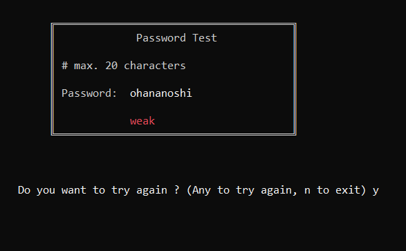
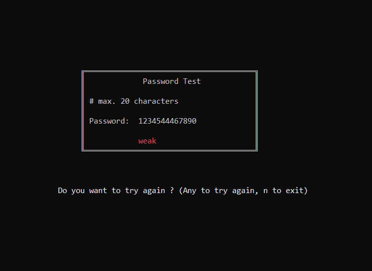
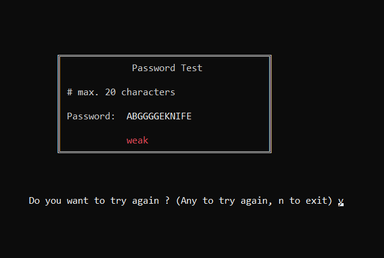
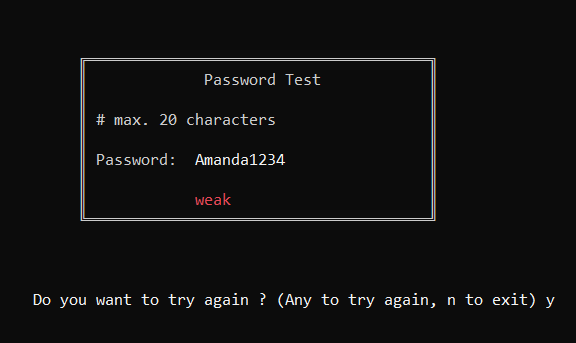
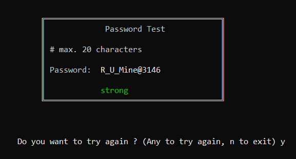

## A simple password tester

#### The password strength is based in some constraints below.

### Password characteristics classification:
- All characters are numbers -> Weak
- All characters are alphabetic and upper -> Weak
- All characteers are alphabetic and lower -> Weak
- Password have less than 6 characters -> Weak
- If some word in dictionary are in password -> Weak

### If none of the above cases happen then the password is classified as strong.

The list of commom passwords in pass_classifier.c file was taken from the topic **Here Are the Most Popular Passwords of 2019** (link below):

<https://nordpass.com/blog/top-worst-passwords-2019/#:~:text=The%20most%20popular%20passwords%20contain,%2C%201qaz2wsx%2C%20etc.).>

### Examples

